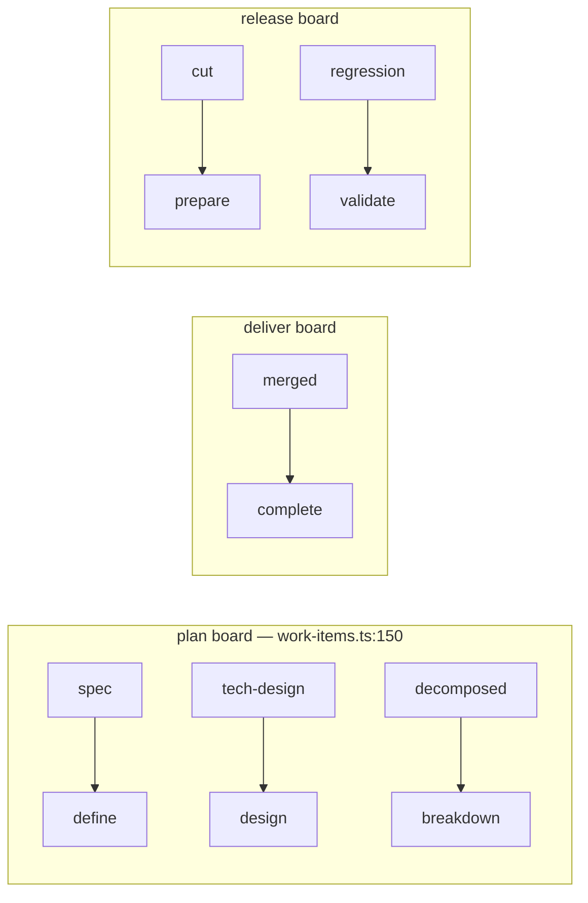
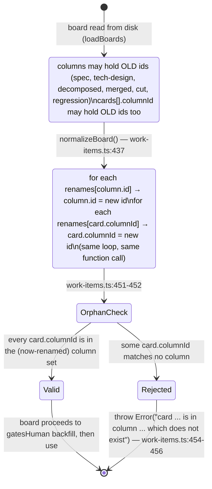
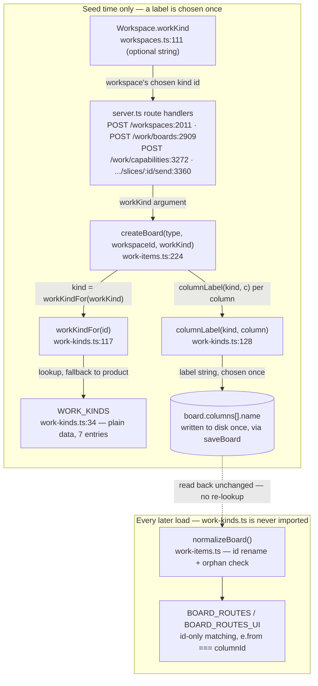

# Domain-neutral work kinds — change diagrams

Range: `96d6d21..04e76af` on `feat/domain-neutral-work-kinds` (commits `fd71020`, `323af83` docs-only, `16a7d1f`, `04e76af`).

## Plain-language summary

The kanban board columns shipped with product-development words baked into their **ids** — `spec`, `tech-design`, `decomposed`, `merged` — and a git word like "Merged" reads wrong for a marketing or sales team, with no way for a user to rename it. This change does two things in sequence: first it renames six column ids to neutral ones (`spec`→`define`, `merged`→`complete`, etc.) and adds a one-time migration so existing boards, their cards, and the two hardcoded route tables all move together; second, it lets each "work kind" (marketing, sales, consulting, content, creator, trading, product) supply its own column *labels* as plain data, looked up only once, when a board is first created. Because ids never change, nothing that matches on ids (routing, the shared queue, card storage) had to change. A real bug rode along: two of the four places that can create a workspace's boards weren't told which work kind to use, so they silently fell back to the software vocabulary — fixed in the last commit.

---

## 1a. The id rename — what moves (data/entity change)

**Entity diagram**, because this is a fixed set of literal id values being remapped, not a process — the diagram exists to let a reviewer eyeball "did every old id get a new home."



- This is the complete rename set — `NEUTRAL_COLUMN_IDS` (`96d6d21..04e76af:swarm/src/work-items.ts:196`) has exactly these six entries under `plan`, `deliver`, `release`; every other column id (`queue`, `ready`, `review`, `verify`, `triage`, …) is untouched.
- The **displayed name** does not move with the id — `deliver`'s `complete` column keeps the label "Merged" (`swarm/src/work-items.test.ts`, test "normalizeBoard keeps a column's displayed name when migrating its id"). Only the id, the thing routing matches on, changes here.
- Nothing risky in the mapping itself — it's a plain 1:1 rename table, hand-checked against the spec's table.

## 1b. The migration pass — process and the orphan terminal state (state diagram)

**State diagram**, because the property that matters is *what runs together in one pass* and *what happens on failure* — a sequence diagram would suggest a multi-step protocol between actors, but this is one function mutating one in-memory object, then asserting an invariant.



- `board.columns[].id` and every `card.columnId` are rewritten in the same function, back to back (`work-items.ts:437-446`) — there is no window where one has moved and the other hasn't.
- The orphan check (`work-items.ts:451-456`) is **not limited to boards that just got renamed** — it runs at the end of `normalizeBoard` for every board, every load, so it also catches any other future column-id mistake, not just this migration's.
- `normalizeBoard` is idempotent: a board already on the new ids has nothing left in `renames[column.id]` to match, so a second run is a no-op (proven by the "normalizeBoard is idempotent on already-migrated ids" test).
- **What this diagram does *not* show, because it isn't a runtime pass:** the two literal route tables — `BOARD_ROUTES` in `swarm/src/work-items.ts:258-274` and `BOARD_ROUTES_UI` in `control-plane/src/lib/board-aggregate.ts` — are hand-edited source literals, not data migrated by `normalizeBoard`. They were updated by hand in the *same commit* (`fd71020`), and a comment in the new control-plane test (`board-aggregate.test.ts`) says so explicitly: "Hand-synced with swarm/src/work-items.ts BOARD_ROUTES. Drift does not corrupt data — the server re-validates — it offers a pill that 400s on click." That's a weaker guarantee than the board-of the migration — see Discrepancies.

---

## 2. Where a label comes from — module relationship (component diagram)

**Component/dependency diagram**, because the property under review is architectural: which modules know about work kinds at all, and where that knowledge stops. This is exactly the "seed-time-only" boundary the design leans on.



- `work-kinds.ts` has exactly one caller, `createBoard` (`work-items.ts:224` imports `columnLabel, workKindFor` from it, `work-items.ts:8`) — no other module in the diff imports it. That's the seed-time boundary made concrete: nothing on the read/route side can reach it.
- `createBoard`'s own docstring states the invariant directly: *"`workKind` is consulted HERE AND NOWHERE ELSE... changing a vocabulary later never rewrites a live board"* (`work-items.ts:217-221`).
- `columnLabel` degrades **per column**, not per board — a work kind missing an entry for one id falls back to that id's template name, so a partial/bad vocabulary file breaks one header, not the board (`work-kinds.ts:128-135`, tested in "columnLabel: a missing label degrades ONE cell, not the board").
- The dashed edge from `Persisted` to `Normalize` is the load-bearing claim to check: once written, a column's `name` is just a string on disk — `normalizeBoard` and the route tables never call back into `work-kinds.ts` to re-derive it.

---

## 3. The seed paths, and the bug that lived in two of them (sequence diagram)

**Sequence diagram**, because this is exactly a call-path/timing question: which route reaches `ensureWorkspaceBoards`/`createBoard` with what argument, and — since `ensureWorkspaceBoards` only creates boards that don't already exist — *which caller gets there first* matters.

```mermaid
sequenceDiagram
    participant Client
    participant PostWS as POST /workspaces<br/>server.ts:2011
    participant PostBoard as POST /work/boards<br/>server.ts:2909
    participant PostCap as POST /work/capabilities<br/>server.ts:3272
    participant Send as .../slices/:id/send<br/>server.ts:3360
    participant WKC as workKindForCapability()<br/>server.ts:3906
    participant Ensure as ensureWorkspaceBoards()<br/>capabilities.ts:362
    participant Create as createBoard()<br/>work-items.ts:224

    Client->>PostWS: create workspace {workKind}
    PostWS->>Ensure: ensureWorkspaceBoards(dirs, resolve, record.name, record.workKind)
    Ensure->>Create: createBoard(type, id, workKind)
    Note right of PostWS: wrapped in .catch(log.warn) — a failure here<br/>does not fail the workspace creation request

    Client->>PostBoard: create one board {workspaceId}
    PostBoard->>PostBoard: ws = loadWorkspaces().find(name)
    PostBoard->>Create: createBoard(type, workspaceId, ws?.workKind)

    rect rgb(255, 225, 225)
    Note over PostCap,Send: BEFORE the fix (introduced at 16a7d1f, still true until 04e76af)
    Client->>PostCap: create capability
    PostCap->>Ensure: ensureWorkspaceBoards(dirs, resolve, cap.workspaceId)
    Note right of Ensure: no workKind argument passed
    Ensure->>Create: createBoard(type, id, undefined)
    Note right of Create: workKindFor(undefined) → "product"
    end

    rect rgb(220, 245, 225)
    Note over PostCap,Send: AFTER the fix — 04e76af
    Client->>PostCap: create capability
    PostCap->>WKC: workKindForCapability(loadWorkspaces(), cap.workspaceId)
    WKC-->>PostCap: workspace's own workKind (or undefined)
    PostCap->>Ensure: ensureWorkspaceBoards(dirs, resolve, cap.workspaceId, workKind)
    Ensure->>Create: createBoard(type, id, workKind)
    end
```

- The bug's mechanism, precisely: `ensureWorkspaceBoards` only creates a board if none exists yet with that id (`capabilities.ts:362-368`, "iff missing"). If `POST /workspaces`'s seed call fails for any reason — it's wrapped in `.catch(this.app.log.warn)` (`server.ts:2011-2018`, comment: "Best-effort: ... must not fail a workspace that already saved") — then the **first** capability or slice-send against that workspace becomes the board's actual seed moment. Before `04e76af` that path passed no `workKind`, so a marketing workspace's boards would be permanently seeded with "Spec / Tech design / Decomposed / Merged" instead of "Brief / Concept / Assets / Live," and there is no way to fix it afterward — the design explicitly rules out retitling a live board.
- `04e76af`'s fix is small and symmetric: one new pure function, `workKindForCapability` (`server.ts:3906-3908`, doc comment explains it's shared by both routes precisely because "whichever route seeds a workspace's boards first silently decides the vocabulary for good"), called identically from both previously-broken sites.
- `POST /work/boards` (`server.ts:2909`) was **not** part of the bug — it already looked up `ws?.workKind` correctly as of `16a7d1f`; only the two capability-adjacent routes were missed, which the diff between `16a7d1f` and `04e76af` confirms is a 2-file, ~45-line change touching only those two call sites plus one new test.
- Every one of these four routes ultimately funnels through the same two functions (`ensureWorkspaceBoards` → `createBoard`), so the fix pattern — resolve the workspace, read `.workKind`, pass it down — is now uniform across all of them.

---

## What to look at if you only have two minutes

- `swarm/src/work-items.ts:196` — `NEUTRAL_COLUMN_IDS`, the entire rename table, six entries.
- `swarm/src/work-items.ts:437-456` — the migration + orphan-assertion, both in `normalizeBoard`.
- `swarm/src/work-kinds.ts:117-135` — `workKindFor` / `columnLabel`, the two functions that are the *only* consumers of the work-kind data.
- `swarm/src/work-items.ts:217-224` — `createBoard`'s docstring and signature: the "consulted HERE AND NOWHERE ELSE" claim.
- `swarm/src/server.ts:3892-3908` — `workKindForCapability` and its doc comment, which states the bug it fixes in its own words.
- `git diff 16a7d1f..04e76af` — the fix commit in isolation: 2 files, both capability-route call sites plus one test.

## Discrepancies

- **"Recovery path" wording.** The brief describes `ensureWorkspaceBoards`'s docstring as calling it a "missing-board recovery path." The actual docstring (`capabilities.ts:352-361`) says "Create the workspace's standing boards iff missing" and never uses the word "recovery." The *behavior* the brief describes is accurate — it's an idempotent create-if-absent function called from four different routes, so it does function as a backstop when the primary `POST /workspaces` seed fails — but that framing is my inference from the code and the `.catch(log.warn)` comment, not a quote from the source.
- **"Both copies of the route table move together in one pass."** This is not literally true at the mechanism level, and worth being precise about: `board.columns[].id` and `card.columnId` really are rewritten together, in one function, at load time (`normalizeBoard`). `BOARD_ROUTES` (swarm) and `BOARD_ROUTES_UI` (control-plane) are **not** migrated by any runtime pass — they are two separately-maintained hardcoded literals that were hand-edited in the same commit (`fd71020`). The new control-plane test even documents this as a known soft spot: drift between the two tables "does not corrupt data... it offers a pill that 400s on click." I've split diagram 1 into 1a/1b partly to make this distinction visible rather than imply a single mechanism covers all three.
- Everything else in the brief — the six id renames, the seed-time-only boundary, the capability-route gap and its fix, the fallback rules (unknown kind → product, missing label → template default, no retitling of live boards) — checked out against the code as described.
