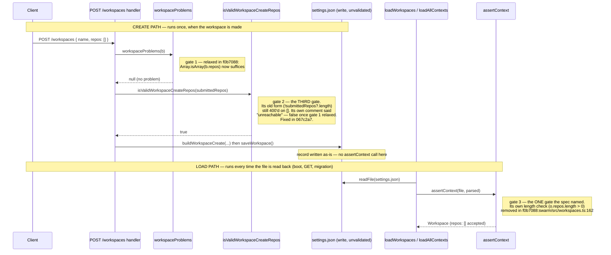
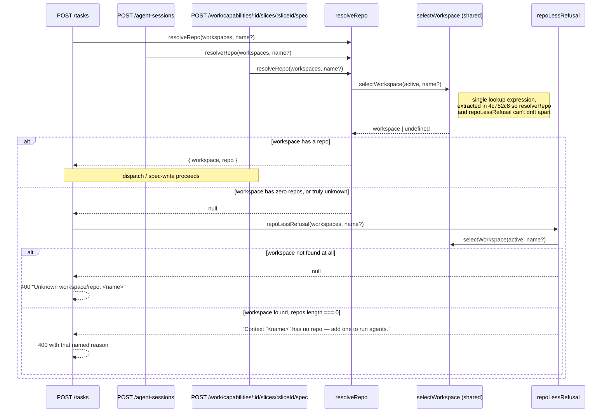
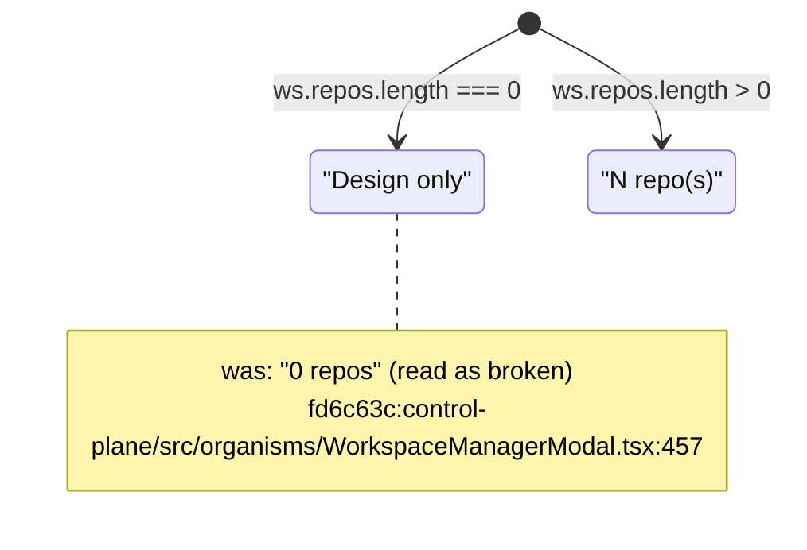

# Change visuals — repo-less contexts

**Pinned range:** `5d2adc6..4c782c8` on `feat/repo-less-contexts`
**Commits:** `f0b7088` relax two validators → `067c2a7` close a third gate + a real discrimination test → `65a746b` truthful refusals at three call sites → `fd6c63c` UI reads as a shape → `4c782c8` share the workspace selection

## Plain-language summary

A workspace used to require at least one git repo, so anyone who only wanted the design half of the product — documents, diagrams, dashboards, boards, the council — had to point at a repo they would never touch. This change makes an empty `repos: []` a legal, complete workspace. Three separate places had independently encoded "a workspace needs a repo," and the first pass only found two of them — the third slipped through because its own code comment claimed it was unreachable, a claim the first pass's fix falsified. Operations that genuinely need a repo (dispatching an agent, writing a spec file) now refuse with a named, actionable reason instead of throwing or silently running against the wrong directory, and the UI stops rendering a repo-less workspace as if it were broken.

---

## Diagram 1 — The three gates (sequence diagram)

**Why a sequence diagram:** this is a *behavioural/control-flow* change — the same invariant ("a workspace needs ≥1 repo") was enforced at three points, and the fix's own history is a control-flow bug: a gate assumed unreachable was, in fact, reachable. A sequence diagram is the only shape that can show *when* each gate runs relative to the others, which the taxonomy calls for over an entity diagram because nothing about the record's stored shape actually changed — only what's accepted at two different lifecycle moments.

**One correction to the brief:** the three gates are not three checkpoints on one request. Two run on **create** (`POST /workspaces`), before anything reaches disk; the third runs on **load**, whenever a workspace file already on disk is parsed back into memory. `saveWorkspace` (`4c782c8:swarm/src/workspaces.ts:440`) writes the JSON straight through — it never calls `assertContext`. That function only runs later, when `loadWorkspaces`/`loadAllContexts` read the file back (first wired at `4c782c8:swarm/src/workspaces.ts:243`).

- The spec (`docs/superpowers/specs/2026-08-15-repo-less-contexts-design.md:47`) named only `assertContext` — gate 3. Gates 1 and 2 both sit in `server.ts` and were found only once the fix was underway.
- Gate 2's bug is the interesting one: `067c2a7` fixed it *and* replaced a weak "positive control" test (`f0b7088`'s version asserted `[].length === 0` in plain JS — it never called `assertContext`) with a real discrimination pair that proves the validator still rejects a malformed repo. Both are visible at `4c782c8:swarm/src/workspaces.test.ts:783-798`.
- Because gate 3 runs on load, not create, a record that reached disk some other way (hand-edited, a future direct-write path) still gets checked the next time it's read — that's the safety property the load-path gate provides that the create-path gates cannot.

## Diagram 2 — The refusal decision (sequence diagram)

**Why a sequence diagram:** three independently-triggered call paths converge on shared resolution logic with a real branch point (three distinct terminal states) — textbook "behavioural/control-flow," and the taxonomy explicitly requires showing *every* participant that can initiate the path, not just the common one.

- Call sites, confirmed by grep, not assumption: `4c782c8:swarm/src/server.ts:819-821` (`POST /tasks`), `:1772-1774` (`POST /agent-sessions`), `:3308-3310` (spec-write route). All three call `resolveRepo` then, only on `null`, `repoLessRefusal` — never the reverse.
- `POST /agent-sessions` is the risky one: before this change it fell through to `resolved?.repo.path ?? process.cwd()` (`4c782c8:swarm/src/server.ts:1783`), which — for a repo-less context — would have launched an agent session rooted in the **swarm's own checkout**, not the user's. The refusal now returns before that line is reached. The comment added at `server.ts:1781-1782` names this explicitly.
- `repoLessRefusal` returns `null` in two different-looking cases that must not be confused: "not found" (existing "Unknown workspace/repo" wording is correct and untouched) vs. "found, no repo" (new, named message). `workspaces.test.ts:846-865` in the final range pins both, plus a test that `resolveRepo` and `repoLessRefusal` agree on the *same* nameless-default workspace (`workspaces.test.ts:867-877`) — guarding exactly the drift the `selectWorkspace` extraction (see below) was built to prevent.

## Diagram 3 — Workspace row label (state diagram)

**Why a state diagram, and why so small:** this is a *UI/surface* change by the taxonomy, but the actual change is one ternary in one row — a full wireframe would imply more states than exist. Two states, both shown, satisfies "every state" without ceremony.

- Only the label changes; the `default` chip and the row's click handler (`selectWorkspace(ws)`) are untouched on both branches — verified by reading the surrounding lines, not just the diff hunk.
- Test coverage for both states lives at `4c782c8:control-plane/src/organisms/WorkspaceManagerModal.test.tsx:467-509` — one asserts "Design only" appears and "0 repos" does not, the other asserts a 2-repo workspace still shows "2 repos".

## No diagram owed

- **Data/stored shape:** the `Workspace` record's shape did not change — `repos: WorkspaceRepo[]` already existed; only which *values* of it validators accept changed. No migration exists, nothing is rewritten on disk. Drawing an entity or migration diagram here would imply a rewrite that never happens.
- **`4c782c8`'s `selectWorkspace` extraction is a pure refactor**, not structural growth: `resolveRepo` and `repoLessRefusal` compute byte-identical output before and after (per the plan's own controller notes and the added agreement test at `workspaces.test.ts:867-877`). Per the standard, this gets an equivalence claim, not a component diagram: the proof is that test, plus the full existing `resolveRepo` suite passing unchanged.

## If you only have two minutes

1. `f0b7088:swarm/src/workspaces.ts:162` — the one-line deletion (`o.repos.length > 0`) that the spec was written for.
2. `4c782c8:swarm/src/server.ts:1944-1947` — the "third gate," and its comment, now correct instead of stale.
3. `4c782c8:swarm/src/server.ts:1772-1783`, especially the note at `:1781-1782` — the `process.cwd()` hazard this change closes.
4. `4c782c8:swarm/src/workspaces.ts:399-403` — `repoLessRefusal`, the two-different-`null`s function.
5. `4c782c8:swarm/src/workspaces.test.ts:783-798` — the discrimination pair that replaced the ceremony "positive control."

## Discrepancies

- **"THREE independent guards" is right, but they are not sequential on one path** — the brief's phrasing ("where they sit relative to each other on the create path") implied all three sit on the create path. Two do (`workspaceProblems`, `isValidWorkspaceCreateRepos`); the third (`assertContext`) runs only on **load**, and `saveWorkspace` never calls it. Diagram 1 shows both paths rather than one, which I believe is the more accurate and more useful picture.
- **Live-smoke verification.** I could not run or observe this myself — I'm read-only on this checkout with no service access. `.superpowers/sdd/2026-08-17-repo-less-contexts/progress.md:65-66` records the controller having run it directly (not delegated) and reports the exact three-way discrimination the brief describes (repo-less → named refusal; workspace with a repo → dispatch queued; nonexistent workspace → "Unknown workspace/repo"), plus a bonus finding that all three standard boards were auto-seeded for the repo-less context. I'm relaying that record, not confirming it independently.
- **Everything else in the brief checked out against the code as described**: the exact refusal wording, the three call sites, the `process.cwd()` hazard, the discrimination-test story, and the group/workspace disambiguation via `members` (verified at `workspaces.ts:149-158`, including the still-current test `assertContext: a GROUP carrying repos is still refused` in the final range).
