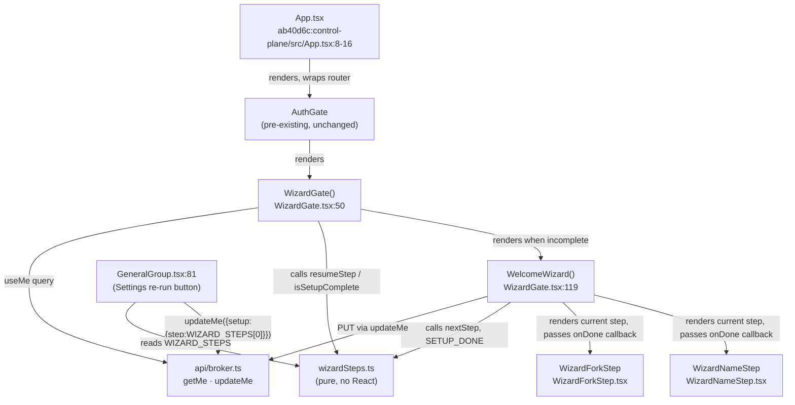
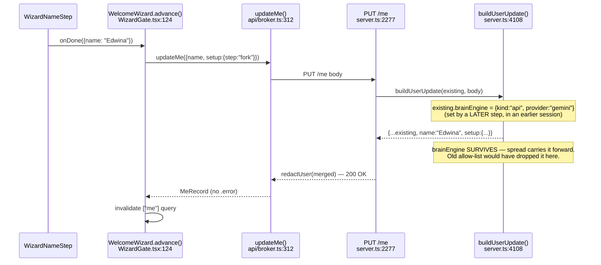
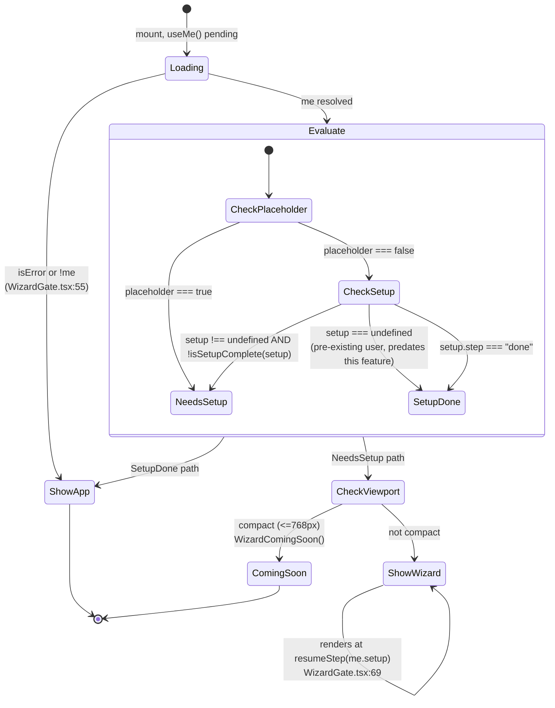
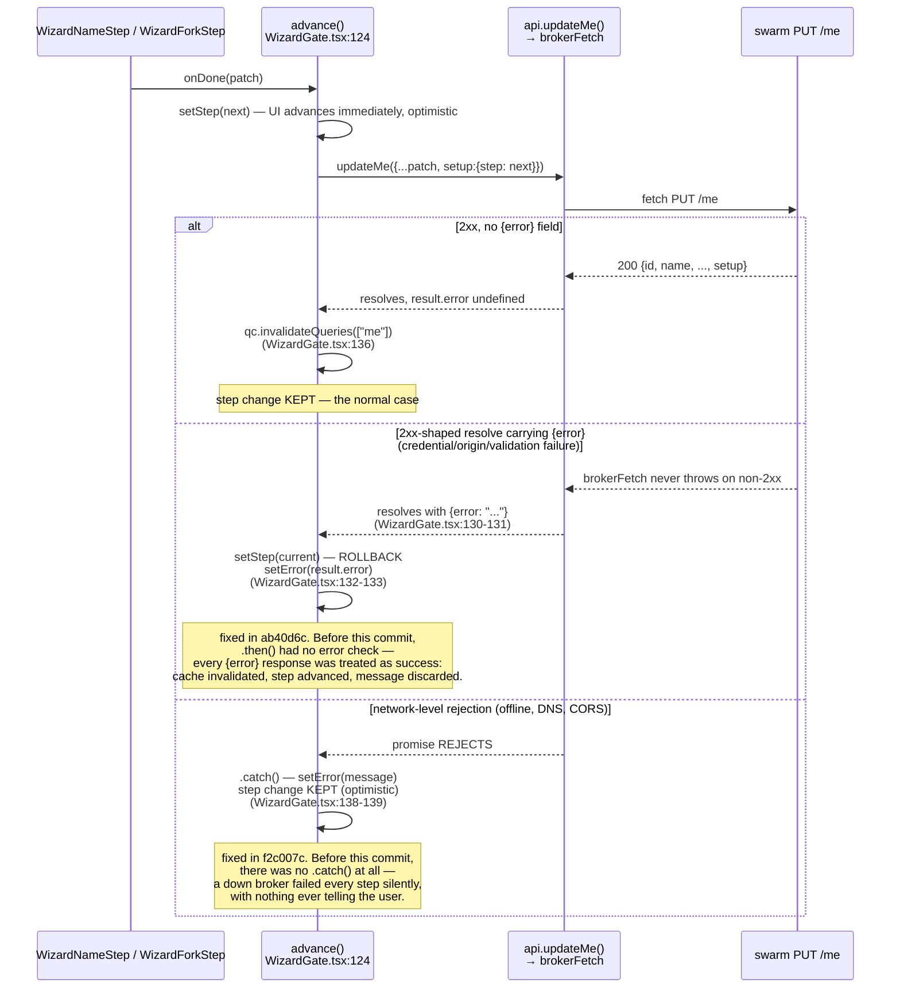

# Change visuals — Welcome Wizard, Plan 1 (the shell)

**Pinned range:** `ec833ea..ab40d6c` on `feat/wizard-shell` (7 commits).

## Plain-language summary

This change builds the frame of a first-run setup wizard, not its content. Two
swarm bugs had to be fixed first: the server was inventing a fake user record
so the client could never tell a fresh install from a real one, and the save
route was silently erasing fields nobody explicitly re-sent. On top of that
fixed foundation sits a gate component that decides — once, on every load —
whether to show the app or the wizard, and where in the wizard to resume; a
two-step wizard (name, then local-vs-hosted with hosted disabled); and a save
path with two genuinely different failure behaviors depending on *how*
`PUT /me` fails. Three of the seven commits are bugs found and fixed inside
this same branch, after the shell already had passing tests — the save path
and the disabled radio button each broke in a way its own unit tests didn't
catch on the first pass.

---

## Diagram 1 — Structural: the new wizard modules and their wiring

**Component diagram**, because this introduces four new modules and changes
one dependency edge (`App.tsx` now sits between `AuthGate` and the router) —
that's a structural change a reader needs oriented before the behavior
diagrams below make sense.



- `wizardSteps.ts` is a leaf: no React import, consumed by both the gate and
  Settings — that's why resume logic is unit-testable without rendering
  anything (`control-plane/src/lib/wizardSteps.test.ts`).
- `WizardNameStep` and `WizardForkStep` are controlled organisms — props and
  an `onDone(patch)` callback only, no fetch of their own, no router import.
  `WelcomeWizard` (inside `WizardGate.tsx`) is the only thing that talks to
  `api/broker.ts`.
- The Settings re-run button (`GeneralGroup.tsx:81`) reaches the same
  `updateMe` mutation through `useUpdateMe()`, not through the wizard's own
  `advance()` — it's a second, independent caller of `PUT /me`, which is why
  Diagram 3's contract change matters to it too.

---

## Diagram 2 — API/contract: `GET /me` and `PUT /me` reshaped

**Before/after contract block**, because this is exactly a route payload
widened and a body-merge behavior changed — the taxonomy's contract kind.

**`GET /me` response** (`redactUser`, `swarm/src/server.ts:4014-4022`):

```diff
  {
    id: string,
    name: string,
    connectors: RedactedConnector[],
+   placeholder: boolean,   // true only when no user record exists at all
+   setup?: { mode?: "local" | "hosted", step?: string },
  }
```

Before this branch, a request against an *empty* users directory returned
`{id:"me", name:"You", connectors:[]}` — byte-identical to a real user who
happens to be named "You". `placeholder` is the only new signal that
distinguishes them (pinned by the test at
`98b19cf:swarm/src/server.test.ts` — `redactUser: says PLAINLY whether a real
user record exists`).

**`PUT /me` merge** (`buildUserUpdate`, `swarm/src/server.ts:4108-4116`):

```diff
- function buildUserUpdate(existing, body: {name?: string}): User {
-   return {
-     id: existing?.id ?? "me",
-     name: body.name?.trim() || existing?.name || "You",
-     default: true,
-     connectors: existing?.connectors,
-     voice: existing?.voice,
-   };
- }
+ function buildUserUpdate(existing, body: {name?: string; setup?: User["setup"]}): User {
+   return {
+     ...(existing ?? {}),
+     id: existing?.id ?? "me",
+     name: body.name?.trim() || existing?.name || "You",
+     default: true,
+     ...(body.setup !== undefined ? { setup: { ...existing?.setup, ...body.setup } } : {}),
+   };
+ }
```

- Old shape was an **allow-list literal**: any `User` field not named in the
  `return` was dropped on every call, including `brainEngine`,
  `researchEngine`, `agendaSweptDay` — none of which the function even
  mentioned. New shape **spreads the existing record** and overrides only
  what the body actually sent.
- Who's obliged to change: nobody downstream — this widens what the route
  preserves, it doesn't remove anything callers relied on. The one new
  obligation is on the client body type (`control-plane/src/api/broker.ts:313`,
  `control-plane/src/queries/http.ts:195`), both widened in the same range to
  add `setup?: MeRecord["setup"]`.
- `setup` merges shallowly against the *existing* `setup`, not overwritten
  outright (`{ ...existing?.setup, ...body.setup }`), so a step update never
  clobbers a `mode` set on an earlier step, and vice versa.

**Sequence — the round trip**, showing why the merge had to move from
allow-list to spread:



---

## Diagram 3 — UI/surface: `WizardGate`'s decision, all five outcomes

**State diagram**, because `WizardGate` is a component whose entire job is
picking one of several things to render from `useMe()`'s result — this is
the taxonomy's "component states... every state including loading and
error" case, and it's the piece the brief calls the subtlest thing in the
branch.



- The branch worth staring at is `CheckSetup --> SetupDone: setup ===
  undefined`. That's `me.placeholder === false && me.setup === undefined` —
  an install from before this feature shipped. `isSetupComplete(undefined)`
  by itself returns `false` (see `wizardSteps.ts:34`), which is why the gate
  does **not** call `isSetupComplete` alone — the guard at
  `WizardGate.tsx:61` explicitly requires `me.setup !== undefined` before
  even asking whether it's complete. Get that condition wrong and every
  existing install falls into the wizard on next load.
- This third state is exercised by name in
  `WizardGate.test.tsx:90` — `"shows the app for a pre-existing user with no
  setup field at all"` — added specifically for this case per
  `WizardGate.tsx:57-60`'s own comment.
- `ComingSoon` is a real terminal state, not a stub: it still renders the
  `→ notify me` link (`WizardGate.tsx:82-84`), so a phone/tablet user isn't
  left with a dead end — same principle as Diagram 4's fork step.
- `Loading -> ShowApp` on error (`isError || !me`) is a deliberate
  fail-open: an unreachable `/me` never blocks the whole app behind the
  gate.

---

## Diagram 4 — Behavioral/control flow: the save path's two failure shapes

**Sequence diagram**, and this is the highest-value diagram in the set. The
brief is right that this is where the real bugs lived — two of the branch's
three fix commits (`f2c007c`, `ab40d6c`) are entirely about this one
function, `advance()` in `WizardGate.tsx:124`.



- The two failure branches are handled **differently on purpose**, and the
  distinction is the whole point: a network rejection is ambiguous (the
  write may have landed on the server despite the client never seeing the
  response), so it stays optimistic and only surfaces a message. A resolved
  `{error}` is the server's unambiguous refusal, so the step is rolled back
  — advancing past it would let the gate reopen on an incomplete `setup`
  forever, since `WizardGate` (Diagram 3) treats "not done" as "show the
  wizard" with no escape hatch and no distinct error state of its own.
- Both fixes shipped as separate commits in this range, in order: `f2c007c`
  added the `.catch()` (optimistic-and-warn), then `ab40d6c` added the
  `result.error` check inside `.then()` (rollback-and-warn) — i.e., the
  first fix alone was insufficient, because it only handled the reject case
  and left the resolve-with-error case still silently advancing.
- `GeneralGroup.tsx:81`'s Settings "re-run setup" button calls `updateMe`
  directly through `useUpdateMe()` (TanStack Query mutation), **not**
  through `advance()` — so it gets neither of these two failure behaviors.
  A failed re-run request there follows whatever `useUpdateMe`'s own
  `onSuccess`/error handling does (`control-plane/src/queries/http.ts:190-199`),
  which this diagram does not cover. Worth a reviewer's eye if re-run is
  expected to behave like a wizard step.

---

## Diagram 5 — Behavioral/control flow: the disabled hosted radio's focus bug

**Sequence diagram**, small and narrow on purpose — this is a single DOM
attribute's worth of change, but it's a real call-path bug (keyboard
navigation reaching a control the UI shows as unreachable), it shipped and
was caught inside this same branch (`6a67042`), and the brief specifically
flagged it as worth judgment. A wireframe would show the same box in both
states and hide the actual mechanism, which is what the standard warns
against — the bug is in *who walks the DOM and what they check*, not in
layout.

```mermaid
sequenceDiagram
    participant User
    participant RG as react-aria useRadioGroup<br/>getNextElement (arrow-key walker)
    participant DOM as hosted &lt;input type="radio"&gt;<br/>WizardForkStep.tsx:94

    User->>RG: ArrowDown, focus on "local"
    RG->>DOM: isFocusable() check

    rect rgb(60, 20, 20)
    Note over RG,DOM: BEFORE 6a67042 — input had aria-disabled only
    DOM-->>RG: isFocusable() selector is input:not([disabled])<br/>— aria-disabled is invisible to it — MATCHES
    RG->>DOM: focus + read .value
    Note over DOM: no value attribute set → defaults to "on"
    RG-->>User: mode state corrupted to "on" (not "local"/"hosted")
    end

    rect rgb(20, 50, 20)
    Note over RG,DOM: AFTER 6a67042 — input also has native disabled
    DOM-->>RG: input:not([disabled]) — NO MATCH, excluded from focus order
    RG-->>User: ArrowDown from "local" has nowhere disallowed to land
    end
```

- The fix (`WizardForkStep.tsx:94`) adds the native `disabled` attribute
  alongside the pre-existing `aria-disabled="true"` — it keeps both rather
  than replacing one with the other, because `aria-disabled` is still what
  the stylesheet keys its dimming and `pointer-events: none` off of
  (`components.css` — `.wizard-fork-step__hosted[aria-disabled="true"]`),
  while `disabled` is what actually removes the input from react-aria's
  focus walk.
- Companion fix in the same commit: `onChange` at `WizardForkStep.tsx:75-77`
  changed from an unchecked `value as Mode` cast to a runtime `value ===
  "local" || value === "hosted"` guard — the cast was the second half of the
  same hole, since it would have let a corrupted `"on"` value through to
  `setMode` without complaint even if the focus fix weren't there.
- This diagram is deliberately **not** how I'd draw the fork step's other
  states (default-selected, hosted dimmed, notify-me link) — those are
  static layout, adequately described in Diagram 1's citations and the
  file's own extensive comment (`WizardForkStep.tsx:9-51`), and drawing them
  would be the wireframe the standard's "It fails review if" column warns
  against manufacturing ceremony for.

---

## What to look at if you only have two minutes

1. `ab40d6c:swarm/src/server.ts:4108-4116` — `buildUserUpdate`'s allow-list
   became a spread. This is the fix that stops the wizard's Name step from
   erasing `brainEngine` on every rename. (Diagram 2)
2. `ab40d6c:control-plane/src/organisms/WizardGate.tsx:57-61` — the
   `needsSetup` condition's three-way branch, specifically the comment
   explaining why `me.setup !== undefined` is checked before
   `isSetupComplete`. Get this wrong and every pre-existing install reopens
   the wizard. (Diagram 3)
3. `ab40d6c:control-plane/src/organisms/WizardGate.tsx:124-140` —
   `advance()`'s `.then()`/`.catch()` split, and specifically line 131's
   `if (result.error)`. This one line is the entire difference between
   commits `f2c007c` and `ab40d6c` — the fix that stops a server-refused
   save from silently advancing the wizard past a step that never actually
   persisted. (Diagram 4)
4. `6a67042:control-plane/src/organisms/WizardForkStep.tsx:94` — `disabled`
   sitting next to `aria-disabled="true"` on one `<input>`. Small, but it's
   the line that stops arrow-key navigation from selecting an option the
   screen shows as unselectable. (Diagram 5)

---

## Discrepancies

The brief was accurate on every substantive claim I checked it against —
both files, all cited line ranges, the three-state gate, and the two
failure-shape split all verified against the code as described. Two things
are worth recording anyway, since the standard asks for anything the code
says differently, however small:

1. **The brief frames the two failure-shape fixes as if they were designed
   together.** They weren't — they're two separate commits (`f2c007c` then
   `ab40d6c`) about twenty minutes apart, and reading `f2c007c`'s diff in
   isolation shows a `.then()` with no error check at all: that commit's own
   fix was *itself* incomplete, still treating every `{error}`-carrying
   resolve as success. The brief's description of the final state (reject
   stays optimistic, resolve-with-error rolls back) is correct for the tip
   of the range, but "handled differently on purpose" undersells that the
   second half of that design was a follow-up bug fix on the first, not
   planned upfront. Diagram 4 shows both commits explicitly for this reason.

2. **The brief says the notify-me link is "kept outside the disabled
   element."** True in effect, but the mechanism is narrower than that
   phrasing suggests: the link (`WizardGate.tsx:82-84` in the
   compact-viewport case, and a sibling of the `<label>` in
   `WizardForkStep.tsx:100-102` in the desktop case) was never inside the
   `aria-disabled` element to begin with — it's a sibling in the same
   parent, not something that was moved out. The file's own comment
   (`WizardForkStep.tsx:48-51`) confirms this was a deliberate placement
   decision from the first version of the component, not a fix applied
   after a leak was found. Worth noting only because "kept outside" reads
   slightly like a correction that happened; it's closer to a constraint
   that was respected from the start.

No discrepancy rose to the level of changing what a diagram should show —
both are phrasing-level, not mechanism-level.
